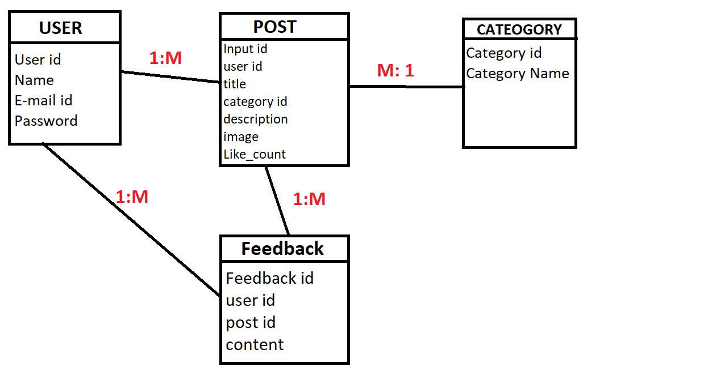

# 🎯 WEBLOG
- The Weblog Project is a frequently updated web page used for personal commentary or business content.

- This site allows Bloggers to share information, opinions, and updates on various topics.

- The users can also view  other people's posts and also they can post their own ideas on a particular topic.

## ER DIAGRAM
## 

- ### 1NF:
    - ✔ Each table has its own `primary key`

    - ✔ There is no '`atomic`'(indivisible) value

- ### 2NF:
    - ✔Follows 1NF.

    - ✔There is no partial `depencies`(no `primary key` determines some other attributes.)

- ### 3NF:
    - ✔Follows 3NF.

    - ✔There is no transitive `depencies`(no non-key attribute determines some other attribute).

- ### 4NF:
    - ✔ Follows 4NF.

    - ✔ No multi-valued `depencies`.

Since these all the four Normalisation are followed by our table,the table is in the normalisation form.

## `EXPLANATION`:
- This ER Diagram consists of the tables `User`,`Post` and `category`.
- The `user table `consists of the details of the user.
- The `post table` consists of the details of the user's posts,
- The `category table ` consists of the information on the particular category the user has posted their ideas.

## API CALLS NEEDED
- SIGN UP:

    - Name

    - E-mail Id

    - Password

- LOGIN:

   - Email Id

   - password

- My Post:

    - user id

    - post id

- Posts on particular category:

    - category id

- Likes:

    - user id 

    - post id

- Feedback:

    - user id 
    
    - post id

    - Comments(Content)

    

 ### `Intially all the post will be available in short`

- To see the full post:

     - post id 

- To see similar posts by the user:

     - user id

- To Post a content:

     - user id 

     - Title

	 - Description

	 - category

	 - image

- Delete a post: 

	- post id

- Update post: 

	- post id

	- Title , Description , category , image

## `EXPLANATION:`

- If the user sends the request for loging in ,the user is able to login in only if the email id and the password matches to the one in the `user table `

- Similarly if the user want to see a post on particular category the user sends a request to the server for that particular category where the category id is fetched from the category table which corresponds to that particular catogory name and with that again the posts related are fetched from the post table.

=======
# Blog
>>>>>>> a82983b10bc9cd882043a499b279fd477b4d4629
